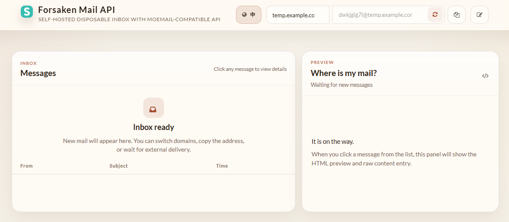

English | [简体中文](./README.zh-CN.md)

# Forsaken Mail API

Forsaken Mail API is a self-hosted disposable mail service forked from Forsaken-Mail, focused on turning the original mailbox project into a more practical inbox service with a  TempMail/MoeMail-compatible receive-side API. In addition to the classic temporary mail workflow, this fork adds persistent SQLite-backed message storage, multi-domain support, and a refreshed web UI tuned for API-first usage.

## Screenshots



[Online Demo](http://disposable.dhc-app.com)

## Installation

### Runtime requirements

- Recommended Node.js runtime: `22.x`
- Docker image target: `node:22-alpine`

This project depends on the built-in `node:sqlite` module and includes a postinstall compatibility patch for the legacy `mailin` / `smtp-server` receive stack so it can run on modern Node versions in the recommended range.

### Setting up your DNS correctly

In order to receive emails, your SMTP server address must be available in DNS. Suppose you want to receive emails at `*@subdomain.domain.com`:

- First add an MX record: `subdomain.domain.com MX 10 mxsubdomain.domain.com`
- Then add an A record: `mxsubdomain.domain.com A the.ip.address.of.your.mailin.server`

You can use an [SMTP server tester](http://mxtoolbox.com/diagnostic.aspx) to verify that everything is correct.

### Quick start

General way:

```bash
npm install && npm start
```

If you want to run this inside a Docker container:

```bash
docker build -t forsaken-mail-api .
docker run --name forsaken-mail-api -d -p 25:25 -p 3000:3000 forsaken-mail-api
```

Open your browser at:

```text
http://localhost:3000
```

## MoeMail-Compatible API

This fork adds a SQLite-backed receive-side API designed to be compatible with the core inbox endpoints from `moemail`.

### What is compatible

- `GET /api/health`
- `POST /api/emails/generate`
- `GET /api/emails`
- `GET /api/emails/:id`
- `GET /api/emails/:id/:messageId`
- `DELETE /api/emails/:id`
- `DELETE /api/emails/:id/:messageId`

This compatibility layer focuses on the inbox/message workflow only. It does not implement MoeMail's user system, API keys, sharing, config management, or send-mail endpoints.

### Storage

Incoming mail is stored in SQLite so the API can return historical messages even when the web UI is not connected.

- default database path: `./main.db`
- override with `FORSAKEN_MAIL_DB_PATH`
- expired inboxes are cleaned on startup and by a background interval job
- cleanup interval override: `FORSAKEN_MAIL_CLEANUP_INTERVAL_MS` (default `300000`)

### Deployment template

Copy `./.env.example` and adjust the values for your environment.

For server deployment, start from `./.env.production.example`.

Recommended starting values for a self-hosted deployment:

```bash
PORT=3000
FORSAKEN_MAIL_DB_PATH=/data/main.db
FORSAKEN_MAIL_DOMAINS=temp.example.com
FORSAKEN_MAIL_CLEANUP_INTERVAL_MS=300000
FORSAKEN_MAIL_ADMIN_PASSWORD=
```

Recommended production notes:

- keep `FORSAKEN_MAIL_DB_PATH` on persistent storage
- set `FORSAKEN_MAIL_DOMAINS` to the exact domains your API should allow
- keep `FORSAKEN_MAIL_CLEANUP_INTERVAL_MS` between `60000` and `300000` for most deployments
- set `FORSAKEN_MAIL_ADMIN_PASSWORD` if you want `temp_mail` admin endpoints protected; leave it empty to skip admin auth
- run the service behind a reverse proxy if you expose the web/API port publicly

### Docker Compose

This repo includes a local `docker-compose.yml` that builds the current fork instead of downloading upstream source.

Quick start:

```bash
cp .env.example .env
docker compose up -d --build
```

What it does:

- publishes `3000` for the web UI and API
- publishes `25` for SMTP reception
- mounts `./data` into the container so SQLite persists across restarts
- respects `FORSAKEN_MAIL_DB_PATH` from your `.env` file
- includes a built-in health check against `http://127.0.0.1:3000/api/health`

Recommended before first run:

- set `FORSAKEN_MAIL_DOMAINS` in `.env`
- make sure port `25` is available on the host
- if you do not want to expose the web UI publicly, put port `3000` behind a reverse proxy or firewall

Important:

- `docker compose` reads the project-level `.env` file automatically
- plain `docker run` does **not** read your project `.env` file automatically
- when using `docker run`, you must pass configuration explicitly with `-e` or `--env-file`

Example with `docker run`:

```bash
mkdir forsaken-mail-api && cd forsaken-mail-api
::copy source code in here

docker build --no-cache -t forsaken-mail-api .
docker run --name forsaken-mail-api -d \
  -p 25:25 -p 3000:3000 \
  -e FORSAKEN_MAIL_DOMAINS=sfz234.com,test.cc.cd \
  -e FORSAKEN_MAIL_DB_PATH=/data/mail.db \
  -v $(pwd)/data:/data \
  forsaken-mail-api
```

### Domain configuration

The API validates requested email domains. By default it uses the `host` value from `config-default.json`.

You can override allowed domains with:

```bash
FORSAKEN_MAIL_DOMAINS=mail.example.com,node.example.com
```

### Supported expiry values

The compatibility layer currently accepts these `expiryTime` values:

- `3600000` (1 hour)
- `86400000` (24 hours)
- `259200000` (3 days)
- `0` (never expires)

If `expiryTime` is omitted, it defaults to `86400000` (24 hours).

### Inbox name behavior

- `name` is optional for `POST /api/emails/generate`
- if `name` is provided, it must match `^[a-z0-9._-]+$`
- if `name` is empty, blank, or omitted, the server auto-generates a valid local-part

### Optional API key protection

For MoeMail-style clients that send an API key header, this service can optionally enforce API key validation.

- default header: `X-API-Key`
- configure with `FORSAKEN_MAIL_API_KEY`
- optionally override header name with `FORSAKEN_MAIL_API_KEY_HEADER`

If `FORSAKEN_MAIL_API_KEY` is empty or unset, the API remains open.

### temp_mail-compatible admin endpoints

This service also exposes a small `temp_mail`-style compatibility layer for Python clients that create inboxes through an admin API and then inspect received mail.

- `POST /admin/new_address`
- `GET /admin/mails`

Admin auth behavior:

- header name: `x-admin-auth`
- configure with `FORSAKEN_MAIL_ADMIN_PASSWORD`
- if `FORSAKEN_MAIL_ADMIN_PASSWORD` is empty or unset, admin auth is skipped

`POST /admin/new_address` example:

```bash
curl -X POST http://127.0.0.1:3000/admin/new_address \
  -H "x-admin-auth: YOUR_ADMIN_PASSWORD" \
  -H "Content-Type: application/json" \
  -H "Accept: application/json" \
  -d '{
    "enablePrefix": true,
    "name": "demo1",
    "domain": "example.com"
  }'
```

Example response:

```json
{
  "address": "demo1@example.com",
  "jwt": "some-user-token"
}
```

`GET /admin/mails` example:

```bash
curl "http://127.0.0.1:3000/admin/mails?limit=1&offset=0" \
  -H "x-admin-auth: YOUR_ADMIN_PASSWORD"
```

Filter by address:

```bash
curl "http://127.0.0.1:3000/admin/mails?limit=20&offset=0&address=test@example.com" \
  -H "x-admin-auth: YOUR_ADMIN_PASSWORD"
```

Example response:

```json
{
  "results": [
    {
      "id": "msg_1",
      "address": "test@example.com",
      "source": "OpenAI <noreply@tm.openai.com>",
      "subject": "Your OpenAI verification code",
      "text": "Your verification code is 123456",
      "html": "<p>Your verification code is <b>123456</b></p>",
      "raw": "Your verification code is 123456",
      "createdAt": 1710000000000,
      "created_at": 1710000000000
    }
  ],
  "total": 1
}
```

This response shape is intended to let Python clients read the email body directly and extract the six-digit OpenAI verification code from `text`, `html`, or `raw`.

## API examples

### Create inbox

```bash
curl -X POST http://localhost:3000/api/emails/generate \
  -H "Content-Type: application/json" \
  -d '{
    "name": "demo123",
    "domain": "disposable.dhc-app.com",
    "expiryTime": 86400000
  }'
```

Create inbox without specifying `name`:

```bash
curl -X POST http://localhost:3000/api/emails/generate \
  -H "Content-Type: application/json" \
  -d '{
    "domain": "disposable.dhc-app.com",
    "expiryTime": 86400000
  }'
```

Example response:

```json
{
  "id": "email_1234567890abcdef",
  "email": "demo123@disposable.dhc-app.com"
}
```

### List inboxes

```bash
curl http://localhost:3000/api/emails
```

Example response:

```json
{
  "emails": [
    {
      "id": "email_1234567890abcdef",
      "address": "demo123@disposable.dhc-app.com",
      "createdAt": 1774520000000,
      "expiresAt": 1774606400000
    }
  ],
  "nextCursor": null,
  "total": 1
}
```

### Read messages for one inbox

```bash
curl http://localhost:3000/api/emails/email_1234567890abcdef
```

Example response:

```json
{
  "messages": [
    {
      "id": "msg_abcdef1234567890",
      "from_address": "sender@example.com",
      "to_address": "demo123@disposable.dhc-app.com",
      "subject": "Hello",
      "content": "plain body",
      "html": "<p>plain body</p>",
      "sent_at": null,
      "received_at": 1774520100000,
      "type": "received"
    }
  ],
  "nextCursor": null,
  "total": 1
}
```

### Read one message

```bash
curl http://localhost:3000/api/emails/email_1234567890abcdef/msg_abcdef1234567890
```

### Delete one message

```bash
curl -X DELETE http://localhost:3000/api/emails/email_1234567890abcdef/msg_abcdef1234567890
```

### Delete one inbox

```bash
curl -X DELETE http://localhost:3000/api/emails/email_1234567890abcdef
```

## Replacing MoeMail

If your client only depends on MoeMail's receive-side API, this project can act as a drop-in replacement with a few caveats:

- keep your client pointed at the same path structure under `/api/emails`
- use one of the supported `expiryTime` values listed above
- expect `nextCursor` to always be `null` for now
- do not call MoeMail-only endpoints such as config, auth, API keys, sharing, or sending

In practical terms, the easiest migration path is:

1. point your client base URL at this service
2. keep using `/api/emails/generate`, `/api/emails`, `/api/emails/:id`, and `/api/emails/:id/:messageId`
3. disable or stub any MoeMail-specific endpoints outside the inbox flow

## Health and pagination

### Health check

```bash
curl http://localhost:3000/api/health
```

Example response:

```json
{
  "status": "ok",
  "storage": "sqlite"
}
```

### Cursor pagination

`GET /api/emails` and `GET /api/emails/:id` now support:

- `limit`: page size, max `100`
- `cursor`: opaque cursor returned by the previous page

Example:

```bash
curl "http://localhost:3000/api/emails?limit=10"
curl "http://localhost:3000/api/emails?limit=10&cursor=<cursor-from-previous-response>"
```

The same pattern works for inbox messages:

```bash
curl "http://localhost:3000/api/emails/email_1234567890abcdef?limit=10"
curl "http://localhost:3000/api/emails/email_1234567890abcdef?limit=10&cursor=<cursor-from-previous-response>"
```

## Verification

Run the test suite with:

```bash
npm test
```
